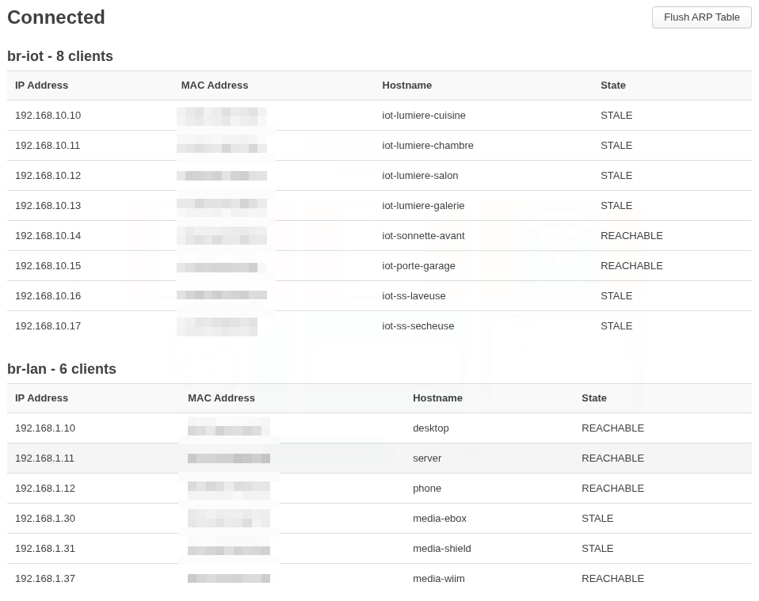

# luci-app-connected

View list of connected devices on OpenWrt using **ip neigh**.

Augmented with hostnames from reverse DNS lookup.

## Install

ssh into the router and run:

    wget -O luci-app-connected.ipk https://github.com/marinierb/luci-app-connected/releases/latest/download/luci-app-connected.ipk
    opkg install luci-app-connected.ipk

## Login to LuCI

Log out and back in for the new menu item to appear.

## Open the new page

In the LuCI Status menu, click on *Connected*

-    **Status -> Connected**

## That's it!

Enjoy!

## Screenshot

