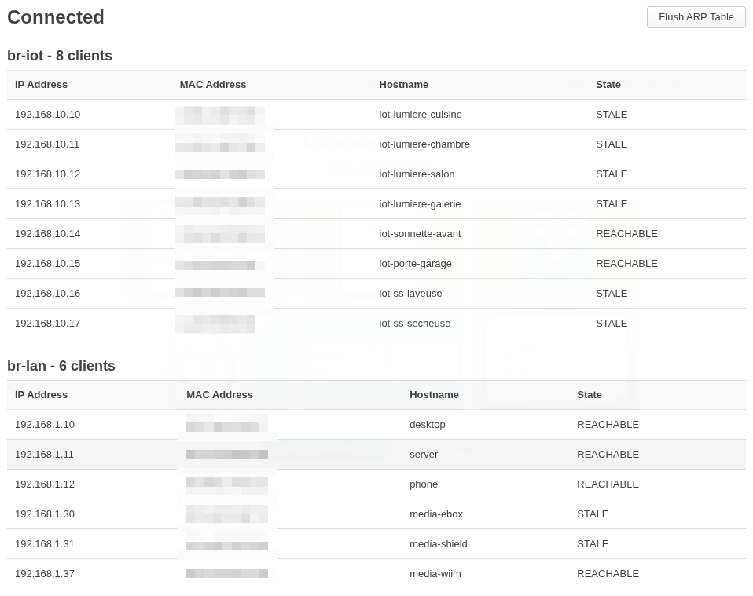

# luci-app-connected

View list of connected devices on OpenWrt using **ip -4 neigh** (so IPv4 only!)

Augmented with hostnames from reverse DNS lookup.



## Important

Version 2 is stricly for OpenWrt 25. Previous versions are for OpenWrt 24 and are frozen.

## Install

ssh into the router and run:

##### On OpenWrt 25

```bash
wget -O luci-app-connected.apk https://github.com/marinierb/luci-app-connected/releases/latest/download/luci-app-connected.apk
opkg install --allow-untrusted luci-app-connected.apk
```

##### On OpenWrt 24

```bash
wget -O luci-app-connected.apk https://github.com/marinierb/luci-app-connected/releases/download/v1.0.6/luci-app-connected.ipk
opkg install luci-app-connected.ipk
```

## Login to LuCI

On OpenWrt 24, log out and back in for the new menu item to appear.

## Open the new page

In the LuCI Status menu, click on *Connected*

-    **Status -> Connected**

## That's it!

Enjoy!
